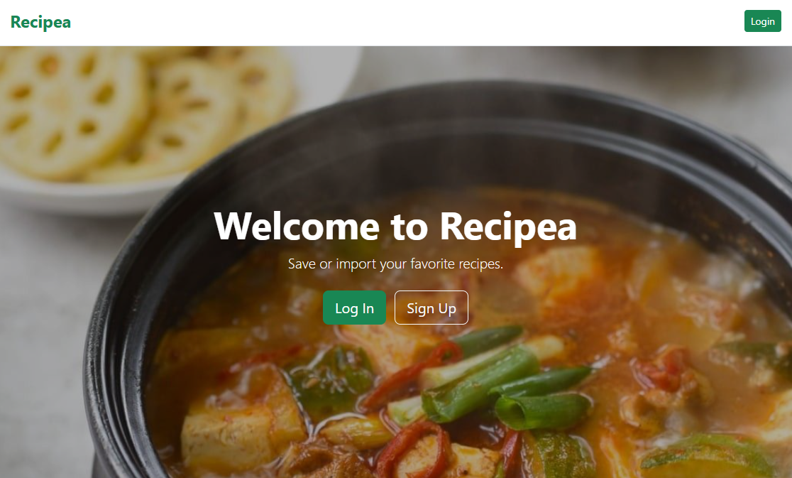
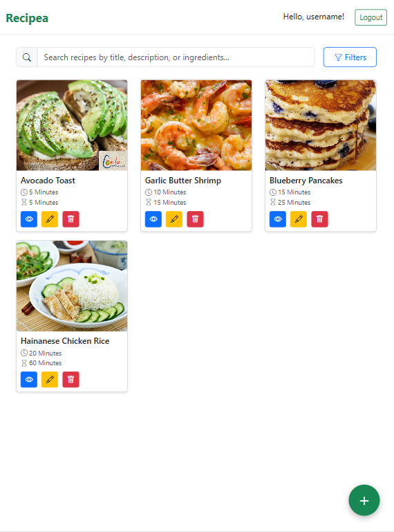
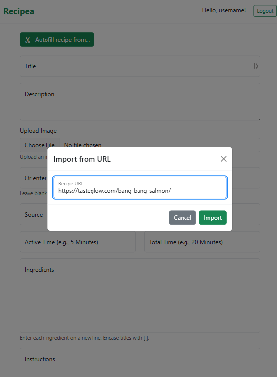
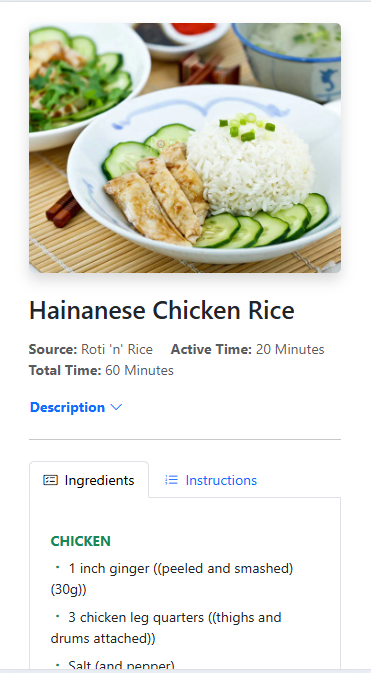

# Recipea 🫛

A recipe management application built with ASP.NET Core, featuring user authentication, image management, and recipe importing capabilities.


## Overview

Recipea is a recipe management app that allows users to create, import and search through their personal recipe collection. With built-in authentication, users maintain their own private recipe libraries.

**Live Demo:** [Visit the deployed app](https://recipea.fly.dev)

## Screenshots

### Desktop View



### Tablet & Mobile Views

<div style="display: flex; gap: 10px; flex-wrap: wrap;">
  
  
  
</div>

## Features

### Authentication & Security

- **ASP.NET Core Identity** - Industry-standard authentication system
- **Individual user accounts** - Each user sees and manages only their own recipes
- **Secure password management** - Hashed passwords with lockout protection
- **Email-based login** - Simple and secure authentication

### Recipe Management

- **Full CRUD operations** - Create, read, update, and delete recipes
- **Rich recipe data** - Ingredients, instructions, descriptions, and sources
- **Time tracking** - Active Time and Total Time fields for meal planning
- **Markdown-style formatting** - Use `[Title]` for organized sections in ingredients and instructions

### Image Management

- **Multiple image options** - Upload files or use external URLs
- **AWS S3 integration** - Scalable cloud storage (currently disabled for cost control)
- **Automatic fallback** - Default placeholder images when none provided
- **Performance optimized** - Smart image handling and compression

### Search & Filtering

- **Full-text search** - Search across titles, descriptions, and ingredients
- **Time-based filters** - Find recipes by Active Time or Total Time
- **User-specific results** - Only see your own recipes

### Recipe Import

- **URL importing** - Import recipes from any website using Spoonacular API
- **Automatic parsing** - Extracts ingredients, instructions, and metadata
- **One-click import** - Simplify adding recipes to your collection

### Modern UI/UX

- **Responsive design** - Optimized for desktop, tablet, and mobile
- **Bootstrap 5** - Clean, modern interface
- **Collapsible descriptions** - Better content organization
- **Intuitive navigation** - Easy to use and navigate

## Tech Stack

### Backend

- **.NET 8.0** -
- **ASP.NET Core Razor Pages** - Server-side rendering with MVVM pattern
- **Entity Framework Core 9.0** - ORM for database operations
- **SQLite** - Lightweight, file-based database

### Frontend

- **Bootstrap 5.3** - Responsive CSS framework
- **Vanilla JavaScript** - ES6+ for interactivity
- **HTML5** - Semantic markup

### Cloud Services

- **AWS S3** - Scalable image storage (tested and ready, currently disabled for cost control)
- **Spoonacular API** - Recipe import parsing service

### Key NuGet Packages

- `AWSSDK.S3` - AWS S3 integration
- `Microsoft.AspNetCore.Identity.EntityFrameworkCore` - Identity authentication
- `Microsoft.AspNetCore.Identity.UI` - Identity UI components
- `Microsoft.EntityFrameworkCore.Sqlite` - SQLite database provider
- `Microsoft.EntityFrameworkCore.Design` - EF Core tooling

## Image Storage Configuration

The app includes full AWS S3 integration that has been tested and verified to work. It is **currently disabled** in the live deployment to control costs.
See `appsettings.json` for configuration options.

### Production (Fly.io)

- **Live deployment** with automated CI/CD via GitHub Actions
- **Persistent storage** for SQLite database
- **HTTPS enabled** with automatic SSL certificates
- **Auto-scaling** with health monitoring
- **Free tier available**

### Docker Support

The app includes full Docker support for easy deployment:

```bash
# Build the image
docker build -t recipea .

# Run the container
docker run -p 8080:8080 recipea
```

## Development

### Prerequisites

- .NET 8.0 SDK
- Git

### Local Setup

1. **Clone the repository**

   ```bash
   git clone https://github.com/yourusername/recipea.git
   cd recipea/Recipea
   ```

2. **Configure settings**

   - Copy `appsettings.Template.json` to `appsettings.Development.json`
   - Add your API keys (optional for basic functionality)

3. **Run the application**

   ```bash
   dotnet restore
   dotnet run
   ```

4. **Access the app**
   - Navigate to `http://localhost:5217`

### Demo Account

For testing purposes, use these credentials:

- **Email:** `alice@wonderland.com`
- **Password:** `password`

The demo account includes pre-seeded recipe data, and the demo db will reset + reseed periodically.
